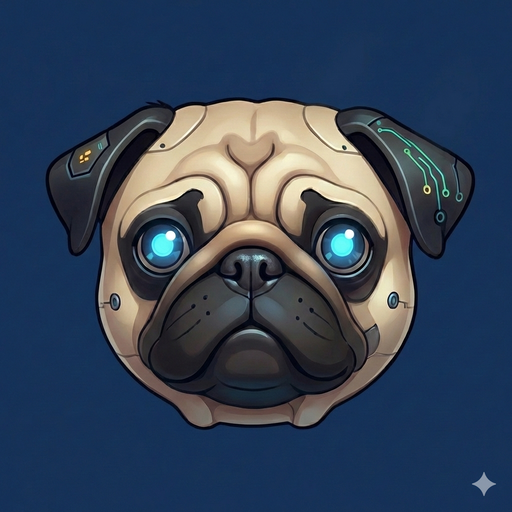

# BillBot

<p align="center">
    
</p>

<p align="center">
    <strong>A personal AI assistant running on a multi-GPU homelab stack</strong><br>
    Fork of <a href="https://github.com/openclaw/openclaw">OpenClaw</a> — customized for NVIDIA DGX Spark integration
</p>

<p align="center">
    <a href="https://github.com/openclaw/openclaw"></a>
    
    
</p>

---

## What is BillBot?

BillBot is a heavily customized fork of [OpenClaw](https://github.com/openclaw/openclaw), an open-source AI gateway and assistant framework. While OpenClaw provides a general-purpose multi-channel AI assistant with support for commercial providers (OpenAI, Anthropic, etc.), BillBot repurposes it as a **fully self-hosted personal AI assistant** running entirely on local hardware.

BillBot runs on three GPUs across two machines:

- **NVIDIA DGX Spark** (GB10 Blackwell, 128GB) -- Primary LLM inference with gpt-oss-120b
- **NVIDIA RTX 3090** (24GB) -- Multimodal services (STT, vision, TTS, image generation, embeddings)
- **AMD Radeon VII** (16GB) -- Long-term memory LLM (Qwen3-8B via Vulkan)

It connects to users through **Discord**, **Telegram**, and a native **Android companion app**, with the gateway exposed on port 18789 via WebSocket and HTTP.

## Fork Changes

This fork diverges significantly from upstream OpenClaw. All upstream features (multi-channel messaging, tool use, skills, workspace, etc.) are preserved, but the following custom infrastructure has been added:

### 1. DGX Spark Provider

Custom provider for NVIDIA DGX Spark running SGLang with gpt-oss-120b (MXFP4 quantization, 131K context window). Connects via SSH tunnel with native tool calling support and Harmony message format. Model compatibility flags: `supportsStore: false`, `supportsStrictMode: false`, `supportsUsageInStreaming: false`.

### 2. Provider Health Check

Periodic health monitoring of model providers with automatic recovery. Detects when the DGX Spark provider becomes unresponsive and triggers reconnection.

### 3. Tunnel Monitor

SSH tunnel watchdog that monitors the `dgx-spark-tunnel` systemd service. Ensures the SSH tunnel to the DGX Spark (port 8001 -> DGX:8000) stays alive and reconnects on failure.

### 4. GPU Metrics

Real-time GPU monitoring collecting temperature, utilization, power draw, and VRAM usage from all three GPUs. Data is exposed via RPC for the Android companion app's hardware dashboard.

### 5. Infrastructure Monitor

Full system status tracking across all services and hardware. Reports inference speeds, service health, and hardware state. Accessible via the gateway's RPC interface.

### 6. Hardware Monitor (LHM Integration)

LibreHardwareMonitor integration for collecting Radeon VII metrics from the Windows host. Polls the LHM HTTP API (`/data.json`) for GPU/CPU/disk sensor data that isn't available through standard Linux tools.

### 7. Context Pruning

Aggressive cache-TTL based context pruning optimized for self-hosted model performance. With a 2-minute TTL and aggressive trim ratios, this keeps context lean to maintain inference speed (20-27 tok/s at 12K context vs. 7-10 tok/s at 53K context).

### 8. Memory Cortex Integration

Long-term memory system powered by a dedicated Qwen3-8B model running on the Radeon VII via Vulkan. Uses SQLite with FTS5 full-text search. The middleware runs on port 8300 and the LLM backend on port 8301.

### 9. Per-Channel-Peer DM Scope

Session isolation mode (`per-channel-peer`) that creates separate conversation contexts for each user in each channel. Prevents DM conversations from bleeding across users or channels.

### 10. Workspace System

File-based workspace at `~/.openclaw/workspace/` containing personality (SOUL.md), tool documentation (TOOLS.md), identity configuration (IDENTITY.md), infrastructure documentation (INFRASTRUCTURE.md), skills, and daily memory logs.

## Architecture

```
Discord / Telegram / Android App
              |
              v
   +---------------------+        +-----------------------------+
   |   OpenClaw Gateway   | SSH    |   NVIDIA DGX Spark          |
   |   :18789             |------->|   SGLang + gpt-oss-120b     |
   |   (WebSocket + HTTP) | :8001  |   GB10 Blackwell, 128GB     |
   +---------------------+        |   FP8 KV cache, :8000        |
              |                    +-----------------------------+
              |
              +---------> RTX 3090 Multimodal Services
              |             :8101  STT (faster-whisper)
              |             :8102  Vision (Qwen2.5-VL-7B-AWQ)
              |             :8103  TTS (Kokoro-82M)
              |             :8104  ImageGen (SDXL-Turbo)
              |             :8105  Embeddings (nomic-embed)
              |             :8106  DocUtils
              |             :8107  FinData (yfinance)
              |
              +---------> Memory Cortex
              |             :8300  Middleware (Python/aiohttp, SQLite+FTS5)
              |             :8301  LLM - Qwen3-8B on Radeon VII (Vulkan)
              |
              +---------> Heartbeat
              |             :8200  Qwen3-1.7B (CPU-only, ~35 tok/s)
              |
              +---------> Hardware Monitoring
                            :8085  LibreHardwareMonitor (Windows host)
```

### Services and Ports

| Port  | Service                      | Host      | Notes                                |
| ----- | ---------------------------- | --------- | ------------------------------------ |
| 8000  | SGLang (gpt-oss-120b)        | DGX Spark | Primary LLM, native tool calling     |
| 8001  | SSH tunnel to DGX:8000       | localhost | systemd: dgx-spark-tunnel            |
| 8085  | LibreHardwareMonitor         | Windows   | GPU/CPU/disk sensor data             |
| 8090  | MCPJungle Gateway            | localhost | MCP proxy, 136 tools, 11 servers     |
| 8101  | STT (faster-whisper)         | localhost | RTX 3090                             |
| 8102  | Vision (Qwen2.5-VL-7B-AWQ)   | localhost | RTX 3090                             |
| 8103  | TTS (Kokoro-82M)             | localhost | RTX 3090                             |
| 8104  | ImageGen (SDXL-Turbo)        | localhost | RTX 3090                             |
| 8105  | Embeddings (nomic-embed)     | localhost | RTX 3090                             |
| 8106  | DocUtils                     | localhost | RTX 3090                             |
| 8107  | FinData (yfinance)           | localhost | RTX 3090                             |
| 8200  | Heartbeat (Qwen3-1.7B)       | localhost | CPU-only, ~35 tok/s                  |
| 8300  | Memory Cortex middleware     | localhost | Python/aiohttp, SQLite+FTS5          |
| 8301  | Memory Cortex LLM (Qwen3-8B) | Windows   | Radeon VII, Vulkan, 45-57 tok/s      |
| 18789 | OpenClaw Gateway             | localhost | WebSocket + HTTP, Discord + Telegram |

## Getting Started

### Prerequisites

- **Node.js** >= 22.12.0
- **pnpm** 10.23.0
- DGX Spark accessible via SSH (for primary LLM inference)
- RTX 3090 with multimodal services running (optional, for multimodal features)
- Radeon VII with llama-server-vulkan (optional, for Memory Cortex)

### Building from Source

```bash
git clone https://github.com/oogleyskr/billbot.git
cd billbot
pnpm install
OPENCLAW_A2UI_SKIP_MISSING=1 pnpm build
bash scripts/fix-runtime-imports.sh dist
```

The `OPENCLAW_A2UI_SKIP_MISSING` flag skips the optional A2UI canvas bundle if dependencies are missing. The `fix-runtime-imports.sh` script patches import paths in the compiled output for runtime compatibility.

### Running the Gateway

```bash
# Start the gateway (foreground)
node dist/entry.js gateway run --verbose

# Start the gateway (background, with logging)
nohup node dist/entry.js gateway run --verbose > /tmp/openclaw-fork.log 2>&1 &

# Stop the gateway
node dist/entry.js gateway stop
```

### Syncing with Upstream

This fork tracks upstream OpenClaw. To pull in upstream changes:

```bash
git fetch upstream
git merge upstream/main
# Resolve any conflicts in fork-specific files
OPENCLAW_A2UI_SKIP_MISSING=1 pnpm build
bash scripts/fix-runtime-imports.sh dist
```

## Configuration

All configuration lives in `~/.openclaw/openclaw.json`. Key settings for this fork:

### Provider

```json
{
  "provider": "spark",
  "providerConfig": {
    "spark": {
      "port": 8001,
      "tunnel": true
    }
  }
}
```

### Model

```json
{
  "model": "spark/gpt-oss-120b",
  "modelConfig": {
    "contextWindow": 131072,
    "maxTokens": 16384,
    "reasoning": true,
    "supportsStore": false,
    "supportsStrictMode": false,
    "supportsUsageInStreaming": false
  }
}
```

### Session Isolation

```json
{
  "session": {
    "dmScope": "per-channel-peer"
  }
}
```

### Context Pruning and Compaction

```json
{
  "contextPruning": {
    "strategy": "cache-ttl",
    "ttl": 120
  },
  "compaction": {
    "maxHistoryShare": 0.35,
    "reserveTokensFloor": 16000
  }
}
```

### Memory Cortex

```json
{
  "memoryCortex": {
    "enabled": true,
    "hwMonitorEnabled": true,
    "hwMonitorHost": "172.17.96.1",
    "hwMonitorPort": 8085
  }
}
```

### Execution

```json
{
  "exec": {
    "security": "full",
    "ask": "off"
  }
}
```

## Hardware Setup

### NVIDIA DGX Spark

The primary LLM runs on a DGX Spark with the GB10 Blackwell superchip (128GB unified memory). SGLang serves gpt-oss-120b with MXFP4 quantization and FP8 KV cache on port 8000. An SSH tunnel (`dgx-spark-tunnel` systemd user service) forwards port 8001 on the gateway host to port 8000 on the DGX.

```bash
# Check DGX service status
ssh mferry@<dgx-ip> "systemctl --user status sglang-server"

# Restart if needed
ssh mferry@<dgx-ip> "systemctl --user restart sglang-server"
```

### NVIDIA RTX 3090

The RTX 3090 (24GB VRAM) runs seven multimodal services concurrently on ports 8101-8107. These are managed by scripts in the [multimodal-stack](https://github.com/oogleyskr/multimodal-stack) repository.

```bash
# Start/stop/check multimodal services
bash ~/multimodal/scripts/start-all.sh
bash ~/multimodal/scripts/stop-all.sh
bash ~/multimodal/scripts/status.sh
```

### AMD Radeon VII

The Radeon VII (16GB HBM2) runs Qwen3-8B via llama-server with Vulkan backend on the Windows host. It serves as the Memory Cortex LLM at 45-57 tok/s. Hardware metrics are collected through LibreHardwareMonitor's HTTP API.

### LibreHardwareMonitor

LHM runs on the Windows host and exposes sensor data at `http://<windows-ip>:8085/data.json`. The gateway polls this endpoint for GPU temperature, utilization, power, and VRAM readings from the Radeon VII (and other hardware).

## Related Repos

| Repo                                                                            | Description                                                            |
| ------------------------------------------------------------------------------- | ---------------------------------------------------------------------- |
| [billbot-android](https://github.com/oogleyskr/billbot-android)                 | Android companion app (Kotlin + Jetpack Compose, Material Design 3)    |
| [billbot-memory-cortex](https://github.com/oogleyskr/billbot-memory-cortex)     | Long-term memory system (SQLite + FTS5 + Qwen3-8B)                     |
| [billbot-mcpjungle](https://github.com/oogleyskr/billbot-mcpjungle)             | MCPJungle gateway configs and scripts (11 servers, 136 tools)          |
| [billbot-service-manager](https://github.com/oogleyskr/billbot-service-manager) | Service manager MCP server (TypeScript, 13 services)                   |
| [billbot-workspace](https://github.com/oogleyskr/billbot-workspace)             | Workspace files (SOUL.md, TOOLS.md, skills, memory)                    |
| [multimodal-stack](https://github.com/oogleyskr/multimodal-stack)               | RTX 3090 multimodal services (STT, vision, TTS, image gen, embeddings) |

## License

MIT -- see [LICENSE](LICENSE).

This project is a fork of [OpenClaw](https://github.com/openclaw/openclaw) by Peter Steinberger. Built by **Oogley** and **Claude**.
